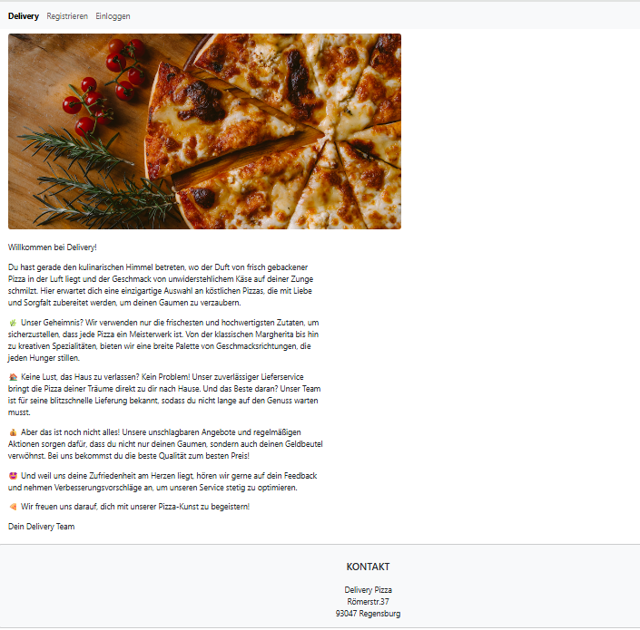
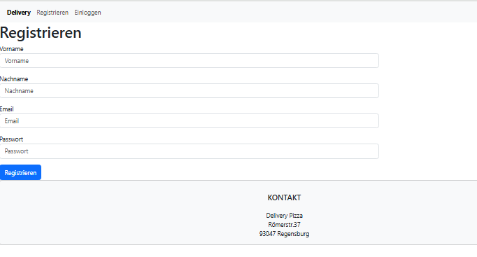
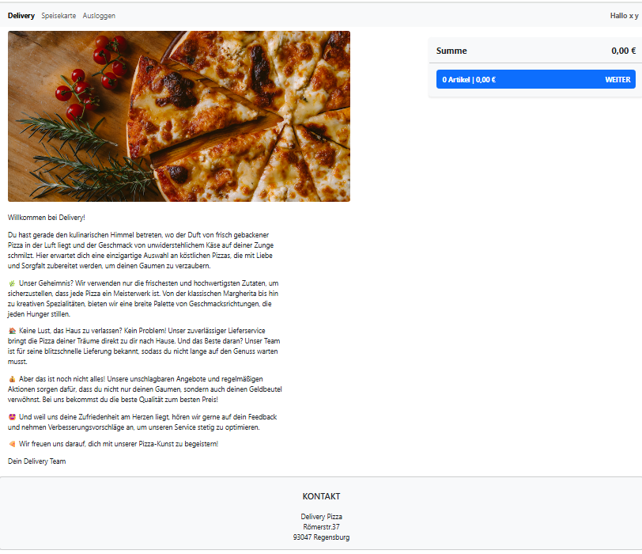
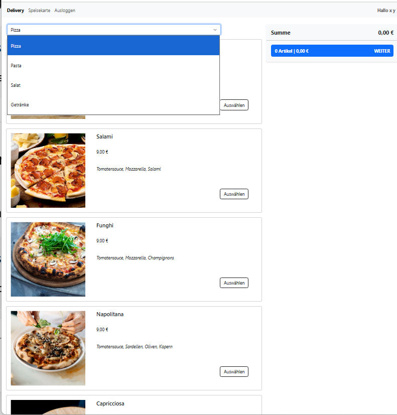

# Delivery Web Application
A web application developed during the **Web Technologies** course at **OTH Regensburg**.

## Technologies
- HTML5
- CSS3
- JavaScript
- Node.js
- Express.js
- Handlebars
- PostgreSQL

## Implemented Features
- Dynamic menu loaded from a PostgreSQL database
- User registration
- User login and logout
- Dynamic page rendering using Handlebars
- Responsive web interface

## What I learned
During this project I gained practical experience with:

- Express routing
- Template engines (Handlebars)
- PostgreSQL databases
- User authentication
- Full-stack web application development

## 📸 Preview

### Home Page

### Registration

### Logged-in User

### Product Menu

